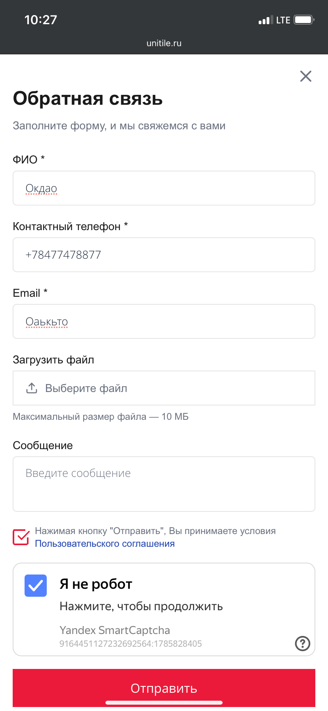

# qa-case-unitile-cross-device-audit

# QA Case Study #4: Cross-Device Form Audit — When "Broken" Turns Out to Be Valid

## Project Overview
**Target:** shakhtinskaya.ru / unitile.ru — ceramic tile manufacturer (Shakhtinskaya, Russia) with dealer network and feedback forms
**My Role:** Independent QA Tester
**Date:** August 2026
**Tools:** Mobile browser (LTE), desktop Chrome (Incognito), DevTools (Network, Console), negative testing

---

## Summary

Cross-device audit of the manufacturer's feedback forms. A mobile pass suggested
the form was sending fine, while the same form appeared "broken" on desktop
(submit button did nothing). A closer look **refuted the hypothesis** — the
desktop version was actually performing phone-number validation correctly and
blocking invalid input. The real bug was elsewhere: no email validation on
either device, plus React hydration errors on the Quality Control page.

The case demonstrates cross-device comparison, hypothesis verification,
and the discipline to re-examine a "failing" form before reporting it.

---

## ✅ Confirmed Findings

### 1. No email validation on feedback forms (Severity: Medium)
- **Evidence:** the form on both mobile and desktop accepted garbage input
  in the required "E-mail address" field (e.g., the Cyrillic string "Оаькъто")
  and submitted successfully with a "Message sent" confirmation.
- **Impact:** invalid emails reach the CRM / mailbox as dead leads —
  no reply possible, sales pipeline polluted.
- **Owner:** first-party form code (no client-side regex / no server-side rejection)

### 2. React hydration errors on Quality Control page (Low/Medium)
- **Evidence:** `Minified React error #418` and `#423` on the
  `/sluzhba-kontrolya-kachestva/` page, triggered during SSR hydration.
- **Impact:** server-rendered HTML and client tree mismatch —
  form may behave unpredictably; risk of future regressions.
- **Owner:** first-party React code

---

## ❌ Excluded Findings (and why)

### 1. "Form doesn't submit on desktop" — hypothesis REFUTED
- **Initial observation:** submit appeared to do nothing on desktop while
  the mobile pass succeeded.
- **Re-examination:** the "Phone" field on desktop was flagged red with
  an invalid test value (`кер` in Cyrillic). The form was not broken —
  **it was performing phone-number validation and blocking submission**.
- **Conclusion:** desktop validation works correctly. Reporting this as
  a bug would have been a false positive.

### 2. Jivo (live chat) SSL error on desktop → tester's environment
- Same LTE cross-check as in the Trio case. Excluded.

### 3. "Empty cards" in the Production carousel → carousel animation
- Cards rotate through animation; all content present on other slides. Not a defect.

### 4. "Cut-off arrows" on the Developers slide → scroll artifact
- White "hotline" block from the next page section overlaps the carousel bottom
  at that scroll position. Arrows visible fully on other slides.

### 5. "Favorites list is empty" green text → UI wording, not a defect

---

## 🔎 Positive Observations

- Phone-number validation works correctly on desktop (rejects invalid input)
- Dealer page with addresses and map renders properly
- Cross-device layout is generally stable

---

## Verification Method

1. **Cross-device pass:** identical test data submitted from mobile (LTE)
   and desktop (Chrome Incognito)
2. **Negative testing:** invalid email string ("Оаькъто") on both devices
3. **Hypothesis re-examination:** "desktop form broken" → verified against
   field-level validation state before reporting
4. **Console/Network triage:** React errors isolated to one page,
   third-party errors excluded by environment check
5. **Responsiveness check:** carousel, addresses, phone links on mobile

---

## Skills Demonstrated

- Cross-device testing with identical data
- Hypothesis verification (re-examined "broken" form before reporting)
- False-positive avoidance: distinguished validation from a defect
- React hydration error recognition
- Negative testing of required field validation
- Environment isolation (third-party SSL issues)

---

## 📸 Screenshots

| Mobile: form accepts invalid email | Desktop: phone validation blocks submit |
|:---:|:---:|
|  |  |

- [03-react-hydration-418.png](screenshots/03-react-hydration-418&423.png) — React #418 & #423 on Quality Control page
- [05-mobile-garbage-email.png](screenshots/05-mobile-garbage-email.png) — invalid email in required field

---

## Contact

**Vladimir** — QA Tester
GitHub: [@2tigerin-source](https://github.com/2tigerin-source)
